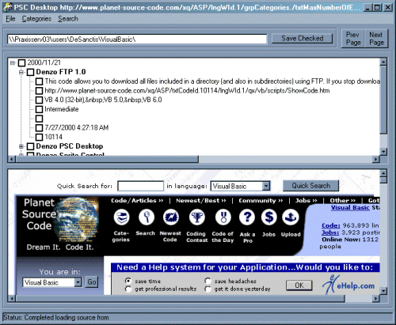



## Denzo PSC Desktop 1\.5

### Description

Updated 11/30/2001!

Now you have a complete support to build a local archive of downloaded files: you can define libraries of omogeneus programs, any item is automatically saved in its own directory and expanded so you can open it with a single click.

Collect your code will be even more simple!

Updated 4/5/2001!

Start as systray Icon, separated browse window from tree window... Works with new policy of PSC!!!

Updated 11/22/2000!

This is an interface to Planet Source Code database. It's simple and very useful, you can see all published softwares, make search, navigate throught categories. In the treeview you can see items information and check the one you prefer to download in an given directory.

When application starts, wait a moment to allow downloading of newest (50) file list and PSC home page. then you can navigate using categories menu and prev/next page buttons, select what you find interesting, define a download directory and download.

Hope it will be useful for everyone. Good work to everyone and vote me!!!!

PS: used some piece of code from PSC with credits inside.
 
### More Info
 
It's assumed tha you have a connection to internet to reach PSC site!

             |
---                |---
**Submitted On**   |2001-11-30 17:26:08
**By**             |[N/A](https://github.com/Planet-Source-Code/PSCIndex/blob/master/ByAuthor/empty.md)
**Level**          |Advanced
**User Rating**    |3.5 (21 globes from 6 users)
**Compatibility**  |VB 6\.0
**Category**       |[Complete Applications](https://github.com/Planet-Source-Code/PSCIndex/blob/master/ByCategory/complete-applications__1-27.md)
**World**          |[Visual Basic](https://github.com/Planet-Source-Code/PSCIndex/blob/master/ByWorld/visual-basic.md)
**Archive File**   |[Denzo\_PSC\_3853511302001\.zip](https://github.com/Planet-Source-Code/denzo-psc-desktop-1-5__1-12988/archive/master.zip)

